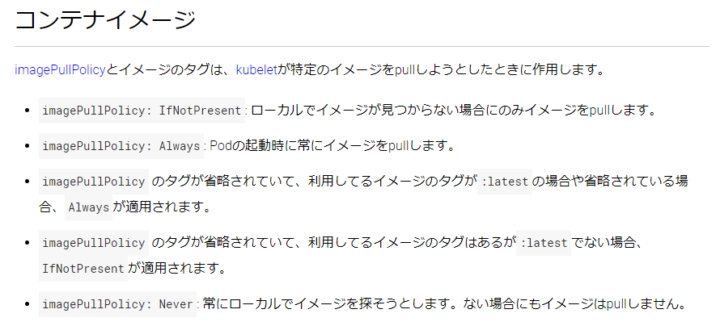
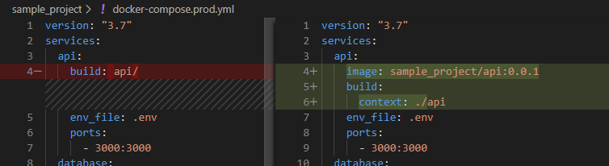

# docker-compose から k8s に入門してみる

2020-02-28 / 【関西】Kubernetes超入門勉強会

---

# だれ？
allegrogiken
犬アバター

---

# dockerの経験

- :o: 開発環境でのdocker経験
  - 環境構築は `docker-compose up` で
- :o: プロダクションでのdocker経験
  - サーバのセットアップを簡単にしたいという理由で、本番でも docker-compose を使った
- :o: マネージドクラウドでのdocker経験
  - 上の流れから、Amazon ECS をちょっとだけ
- :x: 開発環境・プロダクションでのk8s利用
  - 勉強中

---

# 今回お話すること

- dockerイメージをいい感じに作る
- docker-compose.yml をいい感じにつくる
- いい感じの docker-compose.yml からいい感じに k8s に入門する

---

# 前提

Docker Desktop インストール済み
- docker, docker-compose が使える
- kubernetes が使える
- kubectl が使える

<br/>

(補足) 私の環境
- Windows 10 Pro + WSL2 + Docker Desktop

---

# よくあるWEBアプリケーション

- データベース
- KVS
- アプリケーション

---

# Dockerfile

```
content...
```

---

# docker-compose.yml

```
content...
```

---

# 立ち上げる

```
logs of docker-compose...
```

---

# 立ち上げる

動いてる感じの画像

---

# ここまでは docker-compose のはなし

docker-compose との付き合いが長いので、k8s を使うときでも docker-compose から入りたい（わがまま）

---

# Kompose

### https://github.com/kubernetes/kompose
### docker-compose.yml からk8sのymlファイルを生成するCLIツール

---

# 使い方

```
$ kompose

Kompose is a tool to help users who are familiar with docker-compose move to Kubernetes.

Usage:
  kompose [command]

Available Commands:
  completion  Output shell completion code
  convert     Convert a Docker Compose file
  down        Delete instantiated services/deployments from kubernetes
  help        Help about any command
  up          Deploy your Dockerized application to a container orchestrator.
  version     Print the version of Kompose

Flags:
      --error-on-warning    Treat any warning as an error
  -f, --file stringArray    Specify an alternative compose file
  -h, --help                help for kompose
      --provider string     Specify a provider. Kubernetes or OpenShift. (default "kubernetes")
      --suppress-warnings   Suppress all warnings
  -v, --verbose             verbose output
```

---

# やってみる

```
$ kompose convert -f docker-compose.yml

INFO Kubernetes file "api-service.yaml" created   
INFO Kubernetes file "api-deployment.yaml" created
INFO Kubernetes file "api-env-configmap.yaml" created
INFO Kubernetes file "kvs-deployment.yaml" created
INFO Kubernetes file "database-service.yaml" created 
INFO Kubernetes file "database-deployment.yaml" created
INFO Kubernetes file "postgres-data-persistentvolumeclaim.yaml" created
```

> なんか出た

---

# レッツデプロイ

```
$ kubectl apply -f api-deployment.yaml 

deployment.extensions/api created
```

```
$ kubectl apply -f api-service.yaml 

service/api created
```
> いけてそう

---

# デプロイした結果

```shell
$ kubectl get pods --all-namespaces
NAMESPACE       NAME                                    READY   STATUS             RESTARTS   AGE
default         api-5948c9b999-mvz7x                    0/1     ImagePullBackOff   0          44m
docker          compose-7b7c5cbbcc-mlv89                1/1     Running            0          47d
docker          compose-api-dbbf7c5db-kvb57             1/1     Running            0          47d
kube-system     coredns-5c98db65d4-7mvx4                1/1     Running            1          47d
kube-system     coredns-5c98db65d4-nnpvm                1/1     Running            1          47d
kube-system     etcd-docker-desktop                     1/1     Running            0          47d
kube-system     kube-apiserver-docker-desktop           1/1     Running            0          47d
kube-system     kube-controller-manager-docker-desktop  1/1     Running            0          47d
...
```
<br/>

> ダメそう👀👀👀

---

# STATUS: ImagePullBackOff

```shell
NAMESPACE  NAME                    READY   STATUS             RESTARTS   AGE
default    api-5948c9b999-mvz7x    0/1     ImagePullBackOff   0          44m
```
<br/>

> GKE のトラブルシューティングいわく
> https://cloud.google.com/kubernetes-engine/docs/troubleshooting?hl=ja#ImagePullBackOff
> > ImagePullBackOff と ErrImagePull は、コンテナが使用するイメージをイメージ レジストリからロードできないことを示します。

---

# deployment のファイルを見てみる

```yml
...
    spec:
      containers:
      - env:
        - name: REDIS_HOST
          valueFrom:
            configMapKeyRef:
              key: REDIS_HOST
              name: api-env
        - name: REDIS_PORT
          valueFrom:
            configMapKeyRef:
              key: REDIS_PORT
              name: api-env
        image: api
        name: api
```
> `api` という名前では docker イメージを参照できない

--- 

# docker-compose でビルドしたコンテナイメージ

`${project}_${service}` の名前で作成される

```shell
$ docker images

REPOSITORY          TAG       IMAGE ID            CREATED        SIZE
sample_project_api  latest    5ee77759cbd3        2 days ago     283MB
```
<br/>

> `image: api` を `image: sample_project_api` に変えたらいけそう

---

# 変えてReデプロイ

```shell
$ kubectl apply -f api-deployment.yaml 
deployment.extensions/api configured
```
```shell
$ kubectl get pods --all-namespaces

NAMESPACE    NAME                          READY   STATUS             RESTARTS   AGE
default      api-5948c9b999-mvz7x          0/1     ErrImagePull       0          14s
docker       compose-7b7c5cbbcc-mlv89      1/1     Running            0          47d
docker       compose-api-dbbf7c5db-kvb57   1/1     Running            0          47d
...
```
<br/>

> ステータスは変わったけどダメそう
> ローカルのコンテナイメージを参照してないのでは？

---

# k8s でローカルのコンテナを使う

https://kubernetes.io/ja/docs/concepts/configuration/overview/#%E3%82%B3%E3%83%B3%E3%83%86%E3%83%8A%E3%82%A4%E3%83%A1%E3%83%BC%E3%82%B8



> ローカルのコンテナイメージが `tag=latest` なのが悪そう

---

# `docker-compose build` でタグを付ける

`docker-compose build` でビルドする時にイメージ名・タグを指定できるらしい
https://amaya382.hatenablog.jp/entry/2017/04/03/034002

#### 修正イメージ


---

# 改めて kompose 

api-deployment.yml
```yml
    spec:
      containers:
      - env:
        - name: REDIS_HOST
          valueFrom:
            configMapKeyRef:
              key: REDIS_HOST
              name: api-env
        - name: REDIS_PORT
          valueFrom:
            configMapKeyRef:
              key: REDIS_PORT
              name: api-env
        image: sample_project/api:0.0.1
        name: api
```
> コンテナイメージの値がいい感じになった(気がする)

---

# さらにReデプロイ

```shell
$ kubectl apply -f api-deployment.yaml 
deployment.extensions/api configured
```

```shell
$ kubectl get pods --all-namespaces

NAMESPACE         NAME                      READY   STATUS                       RESTARTS   AGE
default           api-7f5f4fdbf7-67nqm      0/1     CreateContainerConfigError   0          13s
...
```
<br/>

> ダメっぽい、しかしSTATUSのエラーは変わった
> イメージは参照できている模様

---

# そういえば

api-deployment.yml に `configMapKeyRef` というものが見えている
```yml
    spec:
      containers:
      - env:
        - name: REDIS_HOST
          valueFrom:
            configMapKeyRef:
              key: REDIS_HOST
              name: api-env
        - name: REDIS_PORT
          valueFrom:
            configMapKeyRef:
              key: REDIS_PORT
              name: api-env
        image: sample_project/api:0.0.1
        name: api
```

---

# configmap
`kompose` で生成されたモノの中に同じような響きのものがあった
<br/>

api-env-configmap.yaml
```yml
apiVersion: v1
data:
  REDIS_HOST: kvs
  REDIS_PORT: "6379"
kind: ConfigMap
metadata:
  creationTimestamp: null
  labels:
    io.kompose.service: api-env
  name: api-env
```
<br/>

`docker-compose` の時は `.env` に書いていた内容となっている

---

# configmap もデプロイしてみる

```shell
$ kubectl apply -f api-env-configmap.yaml 
configmap/api-env created
```
...

```shell
$ kubectl get pods --all-namespaces

NAMESPACE   NAME                     READY   STATUS             RESTARTS   AGE
default     api-7f5f4fdbf7-67nqm     0/1     CrashLoopBackOff   1          5h8m
...
```
<br/>

> またSTATUSが変わったが、起動はできてない模様

---

# ログを見る

```shell
$ kubectl apply -f api-env-configmap.yaml 
configmap/api-env created
```
...

```shell
$ kubectl logs api-7f5f4fdbf7-67nqm

Unhandled exception: Socket::Addrinfo::Error: Hostname lookup
for kvs failed: No address found (Redis::CannotConnectError)
  from /app/lib/redis/src/redis/connection.cr:10:5 in 'connect'
  from /app/src/main.cr:7:1 in '__crystal_main'
  from /usr/share/crystal/src/crystal/main.cr:106:5 in 'main'
```

<br/>

> Redis の接続エラーでアプリケーションが落ちている
> 確かに Redis のデプロイはまだ行っていない 😇

