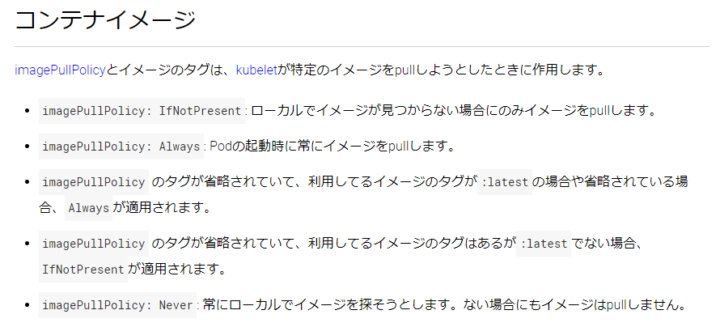
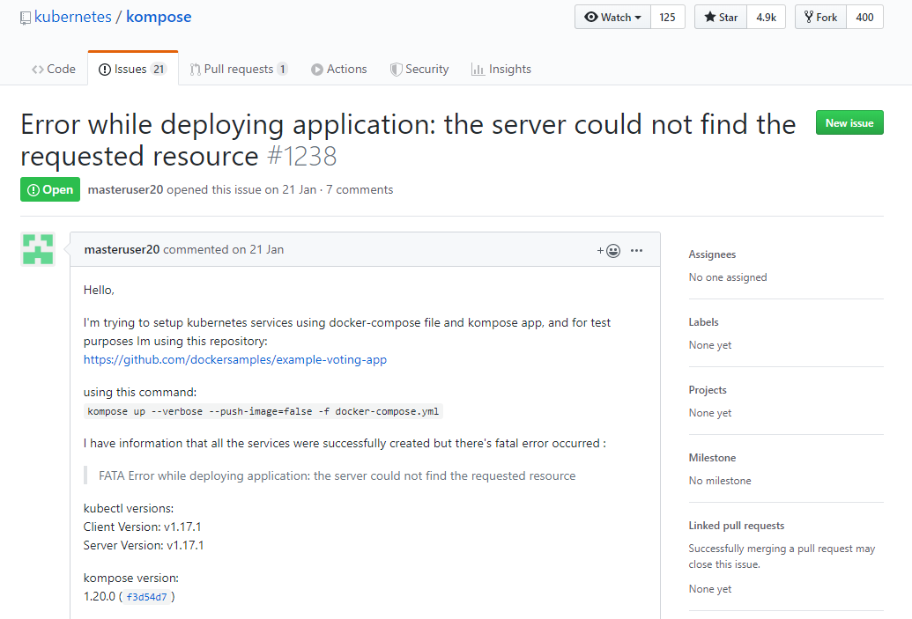

# docker-compose から k8s に入門してみる

2020-02-28 / 【関西】Kubernetes超入門勉強会

---

# 登壇者

**@vvanitter82**
**VVani / allegrogiken**

**関西圏**
**エンジニア8年目くらい**


---

# 私とコンテナの関係

- :o: 開発環境でのコンテナ活用経験
  - 環境構築は `docker-compose up` で
- :o: プロダクションでのコンテナ活用経験
  - サーバのセットアップを簡単にしたいという理由で、本番でも docker-compose を使ったことがある
- :o: パブリッククラウドでのコンテナ活用経験
  - 上の流れから、Amazon ECS をちょっとだけ
- :x: 開発環境・プロダクションでのk8s活用経験
  - 勉強中
  - このスライドを作ってる間に学んでる

---

# 今回のテーマ

- `docker-compose up` で立ち上がる開発環境を土台にして、
  ローカルの kubernetes にデプロイするまでの流れを追体験してもらう

### 話さないこと

- 本番運用に耐えうる kubernetes の使い方
  - 開発環境用にフォーカスしています
- パブリッククラウド上(AWS とか GCP とか) の話
  - ローカル環境にフォーカスしています

---

# 前提

Docker Desktop インストール済み
- docker, docker-compose が使える
- kubernetes が使える
- kubectl が使える

<br/>

試したときの環境
- Windows 10 Pro + WSL2(Ubuntu) + Docker Desktop
- Terminal 操作はすべて Ubuntu 側で実施
- Docker CE: `v19.03.5` / Kubernetes: `v1.15.5`

---

# よくあるWEBアプリケーション

今回用のサンプルプロジェクト

- APIアプリケーション
  - 個人的な趣味を兼ねて `crystal` という Ruby 風の静的型付け言語で作成
- redis
- データベース(今回は省略)

---

# Dockerfile

```dockerfile
# ビルドしてシングルバイナリを作成する用のコンテナ                                                             
FROM crystallang/crystal:0.33.0-alpine-build AS builder

RUN mkdir /app
WORKDIR /app

ADD ["./shard.yml", "./shard.lock", "./"]
RUN shards install

ADD ./ .
RUN crystal build src/main.cr --release --static

# ビルド済みバイナリを builder から持ってきて動かすコンテナ
FROM busybox

WORKDIR /root
COPY --from=builder /app/main .

CMD ["./main"]
```

---

# docker-compose.yml

```yaml
version: "3.7"                                                                         
services: 
  api:
    build: 
      context: ./api
    env_file: .env
    ports:
      - 3000
    depends_on:
      - kvs
  kvs:
    image: redis:6.0-rc1
```

---

# .env

docker-compose.yml でサービスに対して設定できる環境変数群

```ini
REDIS_HOST=kvs
REDIS_PORT=6379
```

---

# 立ち上げる

```shell
$ docker-compose up -d                                                                 
Starting sample_project_kvs_1 ... done
Starting sample_project_api_1 ... done
```
```shell
$ docker-compose ps
        Name                      Command               State            Ports
---------------------------------------------------------------------------------------
sample_project_api_1   ./main                           Up      0.0.0.0:32779->3000/tcp
sample_project_kvs_1   docker-entrypoint.sh redis ...   Up      6379/tcp
```

---

# APIが動いている様子

```shell
$ curl localhost:32779                                                                 
Hello World! #1⏎

$ curl localhost:32779                                                                 
Hello World! #2⏎

$ curl localhost:32779                                                                 
Hello World! #3⏎
```

コールされる度に Redis の特定キーを加算するだけ

---

# ここまでは docker-compose のはなし

docker-compose との付き合いが長いので、k8s を使うときでも docker-compose から入りたい（わがまま）

---

# Kompose

### docker-compose.yml からk8sのyamlファイルを生成するCLIツール
> Kubernetes + Compose = Kompose 
> https://kompose.io / https://github.com/kubernetes/kompose


### インストール (on Ubuntu)
※ 2020/02/20 時点の `README.md` から引用
```shell
$ curl -L https://github.com/kubernetes/kompose/releases/download/v1.20.0/kompose-linux-amd64 -o kompose

$ chmod +x kompose
$ sudo mv ./kompose /usr/local/bin/kompose
```

---

# 使い方

```
$ kompose

Kompose is a tool to help users who are familiar with docker-compose move to Kubernetes.

Usage:
  kompose [command]

Available Commands:
  completion  Output shell completion code
  convert     Convert a Docker Compose file
  down        Delete instantiated services/deployments from kubernetes
  help        Help about any command
  up          Deploy your Dockerized application to a container orchestrator.
  version     Print the version of Kompose

Flags:
      --error-on-warning    Treat any warning as an error
  -f, --file stringArray    Specify an alternative compose file
  -h, --help                help for kompose
      --provider string     Specify a provider. Kubernetes or OpenShift. (default "kubernetes")
      --suppress-warnings   Suppress all warnings
  -v, --verbose             verbose output
```

---

# やってみる

```
$ kompose convert -f docker-compose.yml

INFO Kubernetes file "api-service.yaml" created   
INFO Kubernetes file "api-deployment.yaml" created
INFO Kubernetes file "api-env-configmap.yaml" created
INFO Kubernetes file "kvs-deployment.yaml" created
```
<br/>

**作業ディレクトリになんか出た :eyes:**

---

# レッツデプロイ

```
$ kubectl apply -f api-deployment.yaml 

deployment.extensions/api created
```

```
$ kubectl apply -f api-service.yaml 

service/api created
```
<br/>

**いけてそう :relaxed:**

---

# デプロイした結果

```shell
$ kubectl get pods

NAMESPACE       NAME                    READY   STATUS             RESTARTS   AGE
default         api-5948c9b999-mvz7x    0/1     ImagePullBackOff   0          44m
...
```
<br/>

**ダメそう 🙄🙄🙄**

---

# STATUS: ImagePullBackOff

```shell
NAMESPACE  NAME                    READY   STATUS             RESTARTS   AGE
default    api-5948c9b999-mvz7x    0/1     ImagePullBackOff   0          44m
```
<br/>

GKE のトラブルシューティングいわく
https://cloud.google.com/kubernetes-engine/docs/troubleshooting?hl=ja#ImagePullBackOff
> ImagePullBackOff と ErrImagePull は、コンテナが使用するイメージをイメージ レジストリからロードできないことを示します。

---

# deployment のファイルを見てみる

```yml
...
    spec:                                                                              
      containers:
      - env:
        - name: REDIS_HOST
          valueFrom:
            configMapKeyRef:
              key: REDIS_HOST
              name: api-env
        - name: REDIS_PORT
          valueFrom:
            configMapKeyRef:
              key: REDIS_PORT
              name: api-env
        image: api
        name: api
```

--- 

# コンテナイメージを参照できていない

`api` という名前では `docker-compose build` で作ったイメージを参照できない
```shell
$ docker image ls api

REPOSITORY          TAG       IMAGE ID            CREATED        SIZE                  
```
<br/>

`docker-compose build` のデフォルトでは、コンテナイメージに `${project}_${service}` という名前をつける

```shell
$ docker images

REPOSITORY          TAG       IMAGE ID            CREATED        SIZE                  
sample_project_api  latest    5ee77759cbd3        1 hours ago    17.4MB
```

---

# deployment を書き換えてみる

```diff
...
    spec:                                                                              
      containers:
      - env:
        - name: REDIS_HOST
          valueFrom:
            configMapKeyRef:
              key: REDIS_HOST
              name: api-env
        - name: REDIS_PORT
          valueFrom:
            configMapKeyRef:
              key: REDIS_PORT
              name: api-env
-       image: api
+       image: sample_project_api
        name: api
```

---

# deployment を書き換えてみる

```shell
$ kubectl apply -f api-deployment.yaml 
deployment.extensions/api configured
```
```shell
$ kubectl get pods

NAMESPACE    NAME                          READY   STATUS             RESTARTS   AGE
default      api-5948c9b999-mvz7x          0/1     ErrImagePull       0          14s
```
<br/>

**ステータスは変わったけどダメそう**
名前からイメージの解決はできたけど、pull しようとしている？ :thinking:

---

# k8s でローカルのコンテナを使う

https://kubernetes.io/ja/docs/concepts/configuration/overview/#%E3%82%B3%E3%83%B3%E3%83%86%E3%83%8A%E3%82%A4%E3%83%A1%E3%83%BC%E3%82%B8



**💡 ローカルのコンテナイメージが `tag=latest` なのが悪そう**

---

# `docker-compose build` でタグを付ける

`docker-compose build` でビルドする時にイメージ名・タグを指定できる
http://docs.docker.jp/compose/compose-file.html#build

`build` と `image` の両方を記述するとそのように動く

```diff
 version: "3.7"                                                                        
 services: 
   api:
     build: 
       context: ./api
+    image: sample_project/api:0.0.1
     env_file: .env
     ports:
       - 3000
     depends_on:
       - kvs
   kvs:
     image: redis:6.0-rc1
```

---

# 改めて kompose 

api-deployment.yml
```yml
    spec:                                                                              
      containers:
      - env:
        - name: REDIS_HOST
          valueFrom:
            configMapKeyRef:
              key: REDIS_HOST
              name: api-env
        - name: REDIS_PORT
          valueFrom:
            configMapKeyRef:
              key: REDIS_PORT
              name: api-env
        image: sample_project/api:0.0.1
        name: api
```
**コンテナイメージの値がいい感じになった**(気がする)

---

# さらにReデプロイ

```shell
$ kubectl apply -f api-deployment.yaml                                                     
deployment.extensions/api configured
```

```shell
$ kubectl get pods

NAMESPACE    NAME                   READY   STATUS                       RESTARTS   AGE
default      api-7f5f4fdbf7-67nqm   0/1     CreateContainerConfigError   0          13s
```
<br/>

**ダメっぽい、しかしSTATUSのエラーは変わった**
イメージは参照できている模様

---

# そういえば

api-deployment.yml に `configMapKeyRef` というものが見えている
```yml
    spec:
      containers:
      - env:
        - name: REDIS_HOST
          valueFrom:
            configMapKeyRef:
              key: REDIS_HOST
              name: api-env
        - name: REDIS_PORT
          valueFrom:
            configMapKeyRef:
              key: REDIS_PORT
              name: api-env
        image: sample_project/api:0.0.1
        name: api
```

---

# configmap
`kompose` で生成されたモノの中に同じような響きのものがあった

> api-env-configmap.yaml
> ```yml
> apiVersion: v1                                                                       
> data:
>   REDIS_HOST: kvs
>   REDIS_PORT: "6379"
> kind: ConfigMap
> metadata:
>   creationTimestamp: null
>   labels:
>     io.kompose.service: api-env
>   name: api-env
> ```

`docker-compose` の時は `.env` に書いていた内容となっている

---

# configmap もデプロイしてみる

```shell
$ kubectl apply -f api-env-configmap.yaml                                              
configmap/api-env created
```

```shell
$ kubectl get pods

NAMESPACE   NAME                     READY   STATUS             RESTARTS   AGE         
default     api-7f5f4fdbf7-67nqm     0/1     CrashLoopBackOff   1          5h8m
```
<br/>

**またSTATUSが変わったが、起動はできてない模様**

---

# ログを見る

```shell
$ kubectl apply -f api-env-configmap.yaml 
configmap/api-env created
```
...

```shell
$ kubectl logs api-7f5f4fdbf7-67nqm

Unhandled exception: Socket::Addrinfo::Error: Hostname lookup
for kvs failed: No address found (Redis::CannotConnectError)
  from /app/lib/redis/src/redis/connection.cr:10:5 in 'connect'
  from /app/src/main.cr:7:1 in '__crystal_main'
  from /usr/share/crystal/src/crystal/main.cr:106:5 in 'main'
```

<br/>

Redis の接続エラーでアプリケーションが落ちている
そういえば Redis のデプロイを行っていない :innocent:

---

# Redisをk8sにデプロイしたいけど

```
$ kompose convert -f docker-compose.yml

INFO Kubernetes file "api-service.yaml" created   
INFO Kubernetes file "api-deployment.yaml" created
INFO Kubernetes file "api-env-configmap.yaml" created
INFO Kubernetes file "kvs-deployment.yaml" created
```

`kompose` が `kvs-service.yaml` を出力していない :thinking:

---

# Redisのserviceも出したい

apiサービスとの違いとして `port` 記述の有無があるが・・
これを加えると出てくるのではないだろうか（雑な直感）

docker-compose.yml
```diff
version: "3.7"                                                                         
 services: 
   api:
     build: 
       context: ./api
     env_file: .env
     ports:
       - 3000
     depends_on:
       - kvs
   kvs:
     image: redis:6.0-rc1
+    ports:
+      - 6379
```

---

# 出た

```diff
$ kompose convert -f docker-compose.yml                                        

  INFO Kubernetes file "api-service.yaml" created
+ INFO Kubernetes file "kvs-service.yaml" created
  INFO Kubernetes file "api-deployment.yaml" created
  INFO Kubernetes file "api-env-configmap.yaml" created
  INFO Kubernetes file "kvs-deployment.yaml" created
```
<br/>

デプロイしよう
```shell
$ kubectl apply -f kvs-deployment.yaml                                                 
deployment.extensions/kvs created
$ kubectl apply -f kvs-service.yaml 
service/kvs created
```

---

# やってみたが・・・

```shell
$ kubectl get pods
NAMESPACE   NAME                    READY   STATUS             RESTARTS   AGE          
default     api-7f5f4fdbf7-67nqm    0/1     CrashLoopBackOff   10         5h37m
default     kvs-d44fc5984-vwqst     1/1     Running            0          2m27s
```

### apiのpodが起動しない状態は変わらず
起動 -> エラー -> 再起動 -> エラー ... のループにはまったので、
10回もやったしもう無理よね・・ っていう状態に見える :thinking:

---

# 人為的に再起動させたら回復しそう

`kubectl` に「再起動する」みたいはものは無さそうだが・・
雑に検索すると「レプリカ数を 0 にしてから 1以上 にすると良い」とある

---

# レプリカ数を 0 にする

```shell
$ kubectl scale deployment api --replicas=0                                            
deployment.extensions/api scaled
```

```shell
$ kubectl get pods

NAMESPACE    NAME                        READY   STATUS    RESTARTS   AGE              
default      kvs-d44fc5984-vwqst         1/1     Running   0          3m37s
...
```

---

# レプリカ数を元に戻す

```shell
$ kubectl scale deployment api --replicas=1                                            
deployment.extensions/api scaled
```

```shell
$ kubectl get pods

NAMESPACE    NAME                        READY   STATUS    RESTARTS   AGE              
default      api-7f5f4fdbf7-97k6k        1/1     Running   0          4s
default      kvs-d44fc5984-vwqst         1/1     Running   0          3m52s
```
<br/>

apiサービスが Running になった！ :tada:

---

# 手元からアクセスしてみたい

サービスの情報を見てみる
```shell
$ kubectl get service api kvs                                                          

NAME   TYPE        CLUSTER-IP       EXTERNAL-IP   PORT(S)    AGE                       
api    ClusterIP   10.104.4.109     <none>        3000/TCP   22h
kvs    ClusterIP   10.102.147.186   <none>        6379/TCP   13h
```
<br/>

この状態でブラウザから `CLUSTER-IP` に対してアクセスしても応答が無い :thinking:

```shell
$ curl 10.104.4.109:3000                                                               

curl: (7) Failed to connect to 10.104.4.109 port 3000: Connection timed out
``` 

---

# ServiceSpec: type=ClusterIP とは

k8s公式チュートリアルの「Serviceを使ったアプリケーションの公開」
https://kubernetes.io/ja/docs/tutorials/kubernetes-basics/expose/expose-intro/
> ```
> ClusterIP (既定値)
> 
> クラスター内の内部IPでServiceを公開します。
> この型では、Serviceはクラスター内からのみ到達可能になります。
> ```

#### おそらく・・
- サービスの設定で `type` を省略すると `ClusterIP` になる
- `ClusterIP` のサービス単体では外部への公開ができないっぽい
- `ClusterIP` のサービス同士での通信はできているっぽい `(api <=> kvs)`

---

# ServiceSpec: type=NodePort

さっきのURLと同じページにある
> ```text
> NodePort
> 
> NATを使用して、クラスター内の選択された各ノードの同じポートにServiceを公開します。
> <NodeIP>:<NodePort>を使用してクラスターの外部からServiceにアクセスできるようにします。
> これはClusterIPのスーパーセットです。
> ```
<br/>

これ使ったらできそうな予感がする（雑な感覚）

---

# NodePort を使ってみる (1)

api-service.yaml の `spec` に `type: NodePort` だけ追記
```diff
 spec:
+  type: NodePort
   ports:
     name: "3000"
     port: 3000
     targetPort: 3000
   selector:
     io.kompose.service: api
```
---

# NodePort を使ってみる (2)

```shell
$ kubectl apply -f api-service.yaml
service/api configured
```

```
$ kubectl get service api kvs

NAME   TYPE        CLUSTER-IP       EXTERNAL-IP   PORT(S)          AGE
api    NodePort    10.104.4.109     <none>        3000:31690/TCP   22h
kvs    ClusterIP   10.102.147.186   <none>        6379/TCP         14h
```
<br/>

ポートが `3000:31690` という表記に変わった
ノード側のポートは空いてるとこを自動で割り当てたように見える

---

# アクセスしてみる

```shell
$ curl localhost:31690
Hello World! #1⏎

$ curl localhost:31690
Hello World! #2⏎
```

#### できた！ :tada:

---

# ここまでの学び

- kompose はしっかり使えた
- docker-compose.yml の書き方にちょっとコツがある 
  - Dockerfile を書いている場合、`コンテナイメージ名:タグ` の記載が必要
  - `ports` を書いてない場合はサービスが作られない
- 外部からアクセスできる状態にするには kompose 後にひと手間必要
  - service の type をいじればOK

---

# (なんとなく)カイゼン

#### :one: kompose で生成されたファイルを弄らず `kubectl apply` したい
- できるだけ docker-compose.yml を軸としたいというわがまま
- 今回書き換えたのは Service の `type: NodePort` だけ
#### :two: `namespace: default` を変更したい
- `default` のままだと他の何かを試したときに混ざる予感がする
- docker-compose では作業ディレクトリをもとにいい感じのグルーピングがはたくので、それと同じ感じにできたらいいな

---

# kompose の生成ファイルを弄らずデプロイしたい (1)

kompose のユーザーガイドを見ると、いい感じの記述がある
https://github.com/kubernetes/kompose/blob/master/docs/user-guide.md

> ### Labels
> kompose supports Kompose-specific labels within the docker-compose.yml file to explicitly define the generated resources' behavior upon conversion, like Service, PersistentVolumeClaim...

---
# kompose の生成ファイルを弄らずデプロイしたい (2)

docker-compose.yml に `label` を書き加えてみよう

```diff
 services: 
   api:
     image: sample_project/api:0.0.1
     build: 
       context: ./api
     env_file: .env
     ports:
       - 3000
+    labels:
+      kompose.service.type: nodeport
     depends_on:
      - kvs
   kvs:
     image: redis:6.0-rc1
     ports:
       - 6379
```
---
# kompose の生成ファイルを弄らずデプロイしたい (3)

```shell
$ kompose convert -f docker-compose.yml                                                

INFO Kubernetes file "api-service.yaml" created 
...
```

api-service.yaml
```yml
  spec:                                                                                
    ports:
    - name: "3000"
      port: 3000
      targetPort: 3000
    selector:
      io.kompose.service: api
    type: NodePort
```
さきほど手で修正したやつと同じ内容になった :+1:

---

# (なんとなく)カイゼン

#### :white_check_mark: ~~kompose で生成されたファイルを弄らず `kubectl apply` したい~~
- ~~できるだけ docker-compose.yml を軸としたい~~
- ~~今回書き換えたのは Service の `type: NodePort` だけ~~
#### :two: `namespace: default` を変更したい
- `default` のままだと他の何かを試したときに混ざる予感がする
- docker-compose では作業ディレクトリをもとにいい感じのグルーピングがはたくので、それと同じ感じにできたらいいな

---

# 全体に namespace をつけたい (1)

公式の docs に書いてある
https://kubernetes.io/ja/docs/concepts/overview/working-with-objects/namespaces/
<br/>

- :one: `kubectl apply` する際に `-n $NAMESPACE` で指定する
  - `-n` を省略した際の namespace が `default` になっている
  - 今回はこっちをやってみる

- :two: 省略時の namespace を変更する
  - docs では `Namespace設定の永続化` と書かれているところ

---

# 全体に namespace をつけたい (2)

やってみる
```shell
$ kubectl create namespace sample-project
namespace/sample-project created
$ kubectl apply -f api-env-configmap.yaml -n sample-project
configmap/api-env created
$ kubectl apply -f kvs-deployment.yaml -n sample-project
deployment.extensions/kvs created
$ kubectl apply -f api-deployment.yaml -n sample-project
deployment.extensions/api created
$ kubectl apply -f kvs-service.yaml -n sample-project
service/kvs created
$ kubectl apply -f api-service.yaml  -n sample-project
service/api created
```
ちょっとめんどいけど、ここは愚直に・・

---

# 全体に namespace をつけたい (3)

```shell
$ kubectl get pods -n sample-project

NAME                   READY   STATUS    RESTARTS   AGE
api-7f497f79cf-jzjw9   1/1     Running   0          67s
kvs-d44fc5984-22cnq    1/1     Running   0          8m48s
```
```
$ kubectl get service -n sample-project

NAME   TYPE        CLUSTER-IP     EXTERNAL-IP   PORT(S)          AGE
api    NodePort    10.101.83.11   <none>        3000:31414/TCP   79s
kvs    ClusterIP   10.96.105.90   <none>        6379/TCP         3m43s
```

```shell
$ curl localhost:31414
Hello World! #1⏎
```
`default` とは別の名前空間で別のモノとしてデプロイできた :+1:

---

# 全体に namespace をつけたい (4)

`default` も `sample-project` も動いている様子
```shell
$ kubectl get pods --all-namespaces

NAMESPACE         NAME                    READY      STATUS    RESTARTS   AGE          
default           api-7f5f4fdbf7-97k6k    1/1        Running   2          23h     
default           kvs-d44fc5984-vwqst     1/1        Running   0          23h     
sample-project    api-7f497f79cf-jzjw9    1/1        Running   0          3h8m    
sample-project    kvs-d44fc5984-22cnq     1/1        Running   0          3h15m   
...
```

せっかくなので `default` 側に作ってしまったモノをお掃除しよう
```shell
$ kubectl delete service kvs api                                                       
service "kvs" deleted
service "api" deleted

$ kubectl delete deployment kvs api
deployment.extensions "api" deleted
deployment.extensions "kvs" deleted
```

---

# 全体に namespace をつけたい (5)

`namespace` 自体を消すと中にあるやつが一気に消えてくれるみたい
```shell
$ kubectl get pods -n sample-project

NAME                   READY   STATUS    RESTARTS   AGE
api-7f497f79cf-jzjw9   1/1     Running   0          26h
kvs-d44fc5984-22cnq    1/1     Running   0          26h
```
```shell
$ kubectl delete namespace sample-project
namespace "sample-project" deleted

$ kubectl get pods -n sample-project
No resources found.
```

:memo: namespace に属さないものもあるらしい
https://kubernetes.io/ja/docs/concepts/overview/working-with-objects/namespaces/

---

# (なんとなく)カイゼンできた

#### :white_check_mark: kompose で生成されたファイルを弄らず `kubectl apply` したい
- できた :tada:
#### :white_check_mark: `namespace: default` を変更したい
- （ちょっとめんどいけど）できた :tada:
- 楽にしたい場合は省略時の `Namespace設定の永続化` をすると良い
  - https://github.com/ahmetb/kubectx がさらに便利らしい

---

# 総仕上げ (1)

### これまでの学びで、docker-compose.yml をもとに<br/>`docker-compose up/down` 感覚で k8s にデプロイできるようになったはず

---

# 総仕上げ (2)

kompose の生成ファイルが `docker-compose.yml` と混ざるとつらいので、
k8sのyamlファイル達を置く専用のフォルダを切っておく

##### ディレクトリのイメージ
```
- /
  - api/
    - src/**
    - Dockerfile
  - kompose-files/
    - (komposeで生成されたyaml)
  - docker-compose.yml
```

**:pushpin: k8s に関するコマンドは `kompose-files` に移動して叩く**

---

# 総仕上げ (3)

コンテナイメージのビルドは `docker-compose` でやる
```shell                                                           
$ docker-compose build                                                                 
... 
Successfully built fdb1a88f5921
Successfully tagged sample_project/api:0.0.1
```

`docker-compose.yml` と混ざらないように `kompose` を動かす
```shell
$ kompose convert -f ../docker-compose.yml

INFO Kubernetes file "api-service.yaml" created   
INFO Kubernetes file "kvs-service.yaml" created   
INFO Kubernetes file "api-deployment.yaml" created
INFO Kubernetes file "api-env-configmap.yaml" created
INFO Kubernetes file "kvs-deployment.yaml" created
```

---

# 総仕上げ (4)

namespace を作っておき、 `kompose` で出た全ファイルを `kubectl apply` する
```
$ kubectl create namespace sample-project                                              
namespace/sample-project created

$ ls *.yaml | xargs -I@ kubectl apply -n sample-project -f @        
deployment.extensions/api created
configmap/api-env created
service/api created
deployment.extensions/kvs created
service/kvs created
```
<br/>

**これでデプロイが完了したはず :+1:**

---

# 総仕上げ (5)

動作確認
```
$ kubectl get service -n sample-project                                                

NAME   TYPE        CLUSTER-IP       EXTERNAL-IP   PORT(S)          AGE
api    NodePort    10.103.98.128    <none>        3000:32299/TCP   57s
kvs    ClusterIP   10.105.145.185   <none>        6379/TCP         56s

$ curl localhost:32299
Hello World! #1⏎
```

いけてそう、なので全部消す
```shell
$ kubectl delete namespace sample-project
namespace "sample-project" deleted
```

---

# いかがでしたか？

---

# 感想

### 体験として

- **docker-compose.yml からわりとシームレスに k8s に入門できた**
  - `kompose` はそれを助けるのに十分なツールだった
<br/>
- **k8s を意識して docker-compose.yml を書くことができた**
  - 「開発環境として」の運用だと、自前コンテナの名前・タグをあまり意識しないと思うが、**意識すると (k8sに関わらず) 本番向けにコンテナを使う機運が高まるはず**

---

# 感想

### 実用面を考えると

- 普段使いの開発環境として k8s を継続的に使っていくメリットは薄そう
  - 特にフロントエンド・動的型付けなスクリプト言語の開発において、HMR(`Hot Module Replacement`) を使うなら `docker-compose` で ホスト:コンテナ間をボリュームマウントする方が楽に見える
<br/>

- ネットワーク周りを意識する必要が生まれるのは悪くない
  - 本番環境を作るときでも「構成」のイメージができているはず
  - その分ハードルは上がるけど..


---

# 注意点

- 変換済み yaml の `apiVersion` が現時点で古いかも
  - Deployment が `extensions/v1beta1` で出るが k8s v1.16 以降で非推奨
  - 今後のアップデートで更新される予定

- `docker-compose.yml` のサポートバージョンが `3.2` まで
  - `3.7` とかのファイルを拒絶するわけではないっぽい

- そのまま本番環境で使えるわけではない
  - 特に外部公開に `NodePort` を使っているあたり
  - 本番ではロードバランサ―を使うのが推奨っぽい
  - 本番運用まで考えるならしっかり本を読みましょう

---

# ここからはおまけ

---

# `namespace: default` を変更したい

kompose 側の情報も眺めてみる..

```shell
$ kompose

Kompose is a tool to help users who are familiar with docker-compose move to Kubernetes.

Usage:
  kompose [command]

Available Commands:
  completion  Output shell completion code
  convert     Convert a Docker Compose file
  down        Delete instantiated services/deployments from kubernetes
  help        Help about any command
  up          Deploy your Dockerized application to a container orchestrator.
  version     Print the version of Kompose
```

**up, down** というコマンドが見える

---

# `namespace: default` を変更したい

### kompose up の usage を見てみる

```shell
$ kompose up --help

Deploy your Dockerized application to a container orchestrator. (default "kubernetes")

Usage:
  kompose up [flags]

OpenShift Flags:
      --build-branch             Specify repository branch to use for buildconfig (default is current branch name)
      --build-repo               Specify source repository for buildconfig (default is current branch's remote url)
      --insecure-repository      Specify to use insecure docker repository while generating Openshift image stream object

Flags:
      --build string        Set the type of build ("local"|"build-config" (OpenShift only)|"none") (default "local")
      --controller string   Set the output controller ("deployment"|"daemonSet"|"replicationController")
  -h, --help                help for up
      --namespace string    Specify Namespace to deploy your application (default "default")
      --push-image          If we should push the docker image we built (default true)
```
namespaceを指定しつつ、`docker-compose up` のノリで使えそうな雰囲気 :thinking:

---

# `namespace: default` を変更したい

### kompose up をやってみる

```shell
$ kompose up -f docker-compose.yml --namespace=sample-project --push-image=false

INFO Build key detected. Attempting to build image 'sample_project/api:0.0.1' 
INFO Building image 'sample_project/api:0.0.1' from directory 'api' 
INFO Image 'sample_project/api:0.0.1' from directory 'api' built successfully 
INFO We are going to create Kubernetes Deployments, Services and PersistentVolumeClaims for
your Dockerized application. If you need different kind of resources, use the 'kompose convert
and 'kubectl create -f' commands instead. 

INFO Deploying application in "sample-project" namespace 
FATA Error while deploying application: the server could not find the requested resource (post services)
```

エラー出た 🙄🙄

---

# `namespace: default` を変更したい

https://github.com/kubernetes/kompose/issues/1238



次のリリース(おそらく近日)でなおる予感
master をビルドしたやつだと動くらしい？（未検証）
